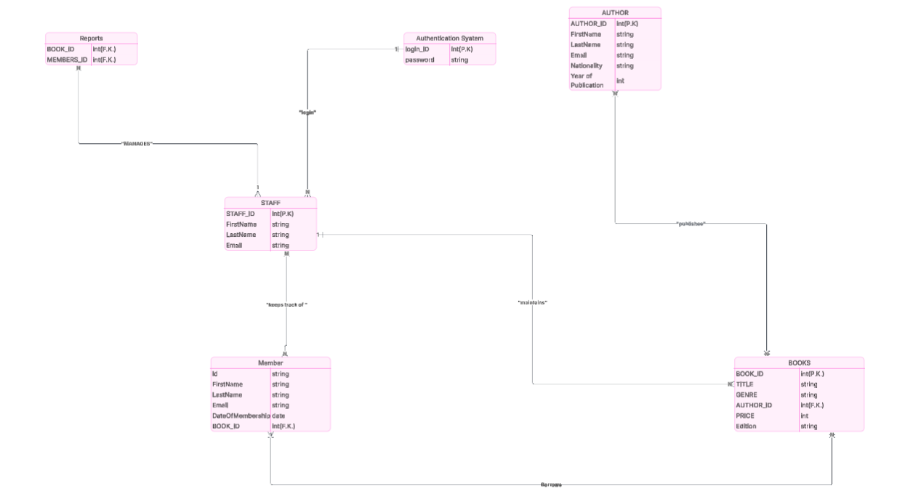

# Welcome to my SQL Internship Tasks repository!
This repository is a comprehensive collection of SQL tasks, exercises, and queries that I completed during my internship. It reflects my hands-on learning journey, where I explored various SQL concepts, practiced real-world problem-solving, and built practical skills in database management and data manipulation.

Through these exercises, I’ve gained experience in writing efficient queries, working with different types of joins, aggregations, subqueries, and handling real datasets. Each file and folder here represents a step in my learning process—showcasing not just the code, but the logic, reasoning, and approach behind solving each problem.

The goal of this repository is to demonstrate my practical SQL skills, attention to detail, and ability to work with structured data—essential skills for any data-driven role.
# Library Management System Database

 Task: Design a relational database schema and normalize it up to 3NF.

 Objective: Efficiently model the library system to ensure data integrity and eliminate redundancy.

# Outcome:

* ER Diagram: Visual representation of entities and relationships.

* SQL Script: Table creation scripts for the normalized schema.

* Normalization Report: Documentation of the 3NF normalization process.
## ER Diagram

